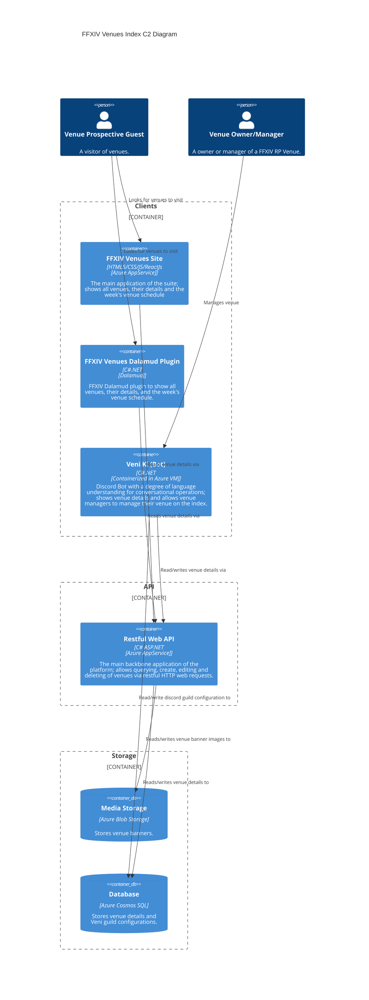

We're a team building venue discoverability and community engagement through open-source technology. We use modern technologies and principles to engineer the application suite atop our foundational stack: Azure, C# .NET, and ReactJs. 

Our flagship application is the Venue Index site (https://ffxivvenues.com/), supported by our cute discord bot Veni Ki, and our Dalamud Plugin; all backed by our Restful Web API. 

Join our community discord is at https://discord.gg/a4BMgkZJ4d 🥳.

## Architecture 

